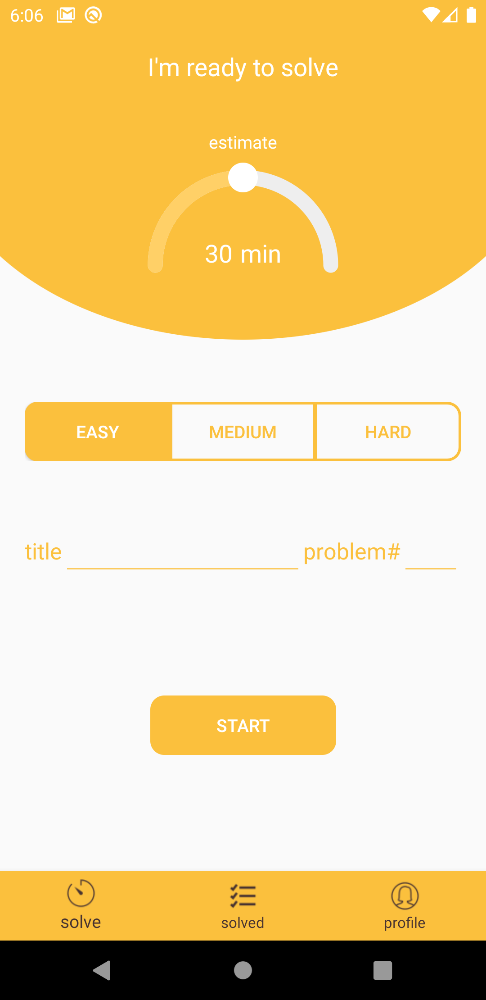
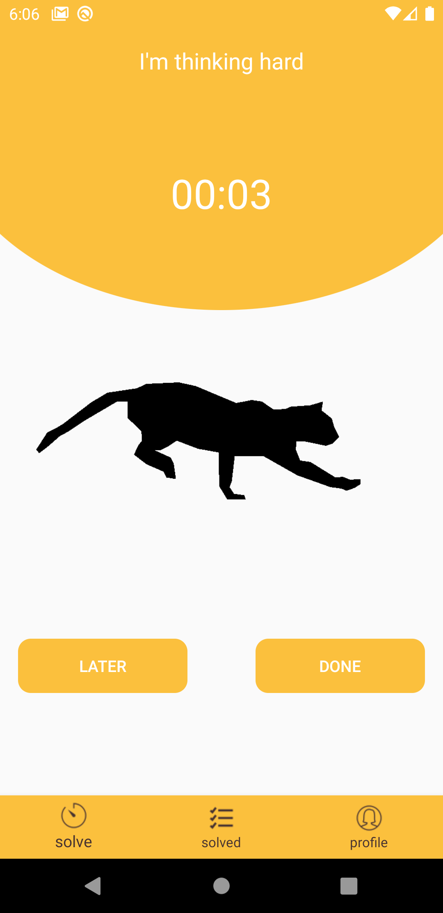
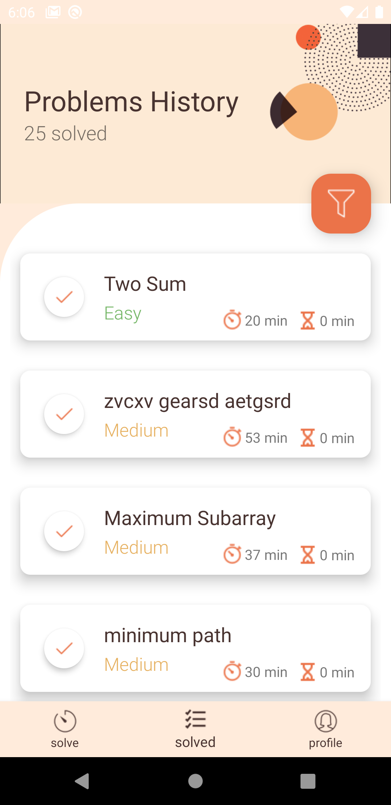
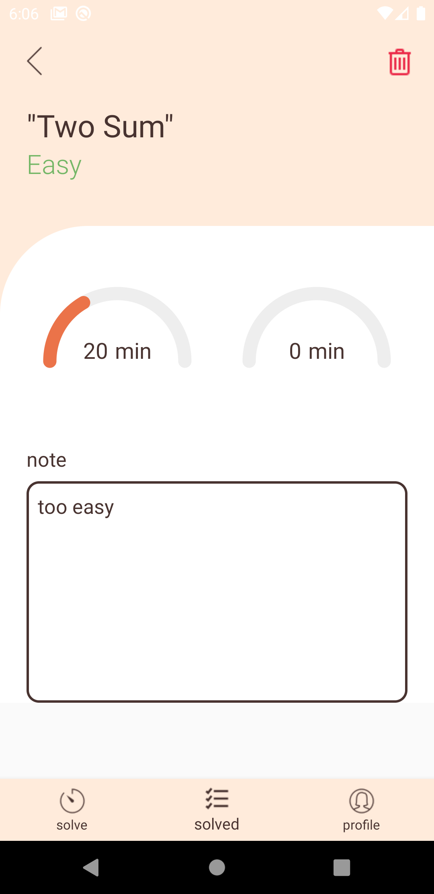

# Leetcode Management App

Created by Tomoaki Mitsuhashi, [GitHub Page](https://github.com/tomoaki3284).
Source code: [Here](https://github.com/tomoaki3284/LCManagmentApp).

## Sample Images

## Who is this project for?
This project is for the people who want to keep track of their Leetcode/Hackerrank work precisely. This app would keep track of the time spent on a problem, organize the solved/attempted problem in a specific order, to manage your progress. 

## What kind of features does this app have?
- [x] Create problem set, and solve it with timer.
- [x] Organize solved/attempted problems in the list
- [x] Leetcode/Hackerrack/Codechef, compatible with many platforms

Available in future updates!
- [ ] Login feature, which enable you to login to your account in any device
- [ ] Visualize user's progress in graph.
- [ ] Create group session to motivate the workload with friends
- [ ] Waiting for ideas...
